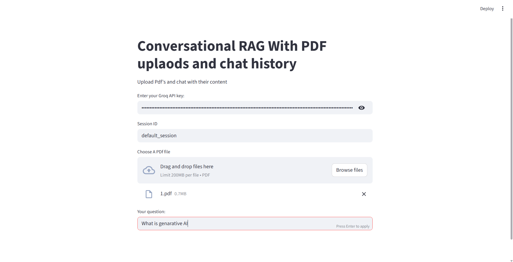
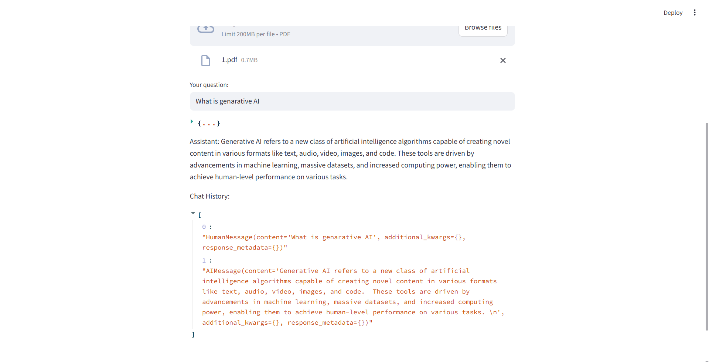
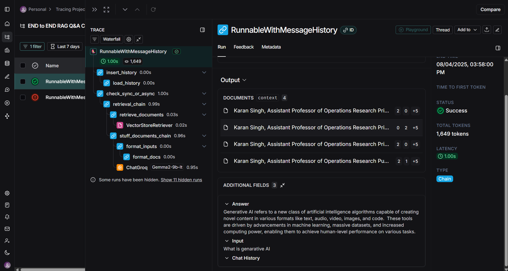

# 📚 RAG Q&A Conversation With PDF Uploads and Chat History

This project is an **end-to-end Conversational Retrieval-Augmented Generation (RAG)** system that allows users to upload **PDF documents** and ask questions based on the document content. The system remembers past interactions using **chat history**, improving multi-turn dialogue accuracy.

Built using **LangChain**, **Streamlit**, **Groq LLMs**, and **ChromaDB**, it showcases how to implement a document-aware, session-based chatbot using modern LLM infrastructure.

## 📁 Project Structure

```
RAG-Q-A-Conversation.../           # ✅ Main RAG Q&A Project
├── .env                           # HuggingFace token (environment variables)
├── .gitignore                     # Git ignore file
├── app.py                         # Main Streamlit app for RAG Q&A with chat history
├── README.md                      # 📘 Project documentation
├── requirements.txt               # Required Python libraries
└── screenshots/                   # 📸 Project screenshots (add this folder)
    ├── 1.png                      # Chat interface screenshot
    ├── 2.png                      # Chat history screenshot
    └── 3.png                      # LangSmith results screenshot
```

## 🚀 Features

* 🗂️ Upload one or multiple PDF files
* 🔍 Ask questions about the content in natural language
* 🧠 Uses Retrieval-Augmented Generation for accurate context-based answers
* 💬 Maintains **session-based chat history** using `RunnableWithMessageHistory`
* 📚 Reformulates questions based on chat history (history-aware retriever)
* 🤖 Powered by **Groq LLM (Gemma-2-9b-IT)** and **MiniLM embeddings**
* 🌐 Simple and interactive UI built using **Streamlit**

## 🛠️ Tech Stack & Tools

| Tool / Library | Purpose |
|---|---|
| `Streamlit` | Frontend UI |
| `LangChain` | RAG pipeline, prompts, history |
| `Groq` + `ChatGroq` | Fast LLM inference (Gemma 2 9B) |
| `HuggingFaceEmbeddings` | Embeddings via MiniLM |
| `Chroma` | In-memory vector database |
| `PyPDFLoader` | Load PDFs as LangChain docs |
| `RecursiveCharacterTextSplitter` | Chunking long documents |
| `dotenv` | API key management |

## 🧪 How It Works

1. **User uploads PDF(s)**
2. Documents are loaded and split into chunks
3. Embeddings are created using `all-MiniLM-L6-v2`
4. Chunks are stored in a Chroma vector store
5. Questions are reformulated using chat history (`history-aware retriever`)
6. Final answers are generated using the RAG pipeline
7. Chat history is saved session-wise

## 🖼️ Screenshots

### Chat Interface


### Chat History and Memory


### LangSmith Monitoring Results


## 🔐 Environment Setup

### 1. Clone the repository
```bash
git clone https://github.com/yourusername/RAG-Q-A-Conversation.git
cd RAG-Q-A-Conversation
```

### 2. Install dependencies
```bash
pip install -r requirements.txt
```

### 3. Set up environment variables
Create a `.env` file in the root directory:
```env
HF_TOKEN=your_huggingface_token_here
```

### 4. Run the application
```bash
streamlit run app.py
```

### 5. Access the app
Open your browser and navigate to: `http://localhost:8501`

## 📌 Requirements

### System Requirements
* Python 3.8+
* 4GB+ RAM recommended
* Internet connection for API calls

### API Keys Needed
* **Groq API Key** (enter in the app interface)
* **HuggingFace Token** (add to `.env` file)

### Core Dependencies
* `streamlit`
* `langchain`
* `langchain-community`
* `langchain-groq`
* `chromadb`
* `pypdf`
* `python-dotenv`
* `sentence-transformers`

## 📈 Example Use Cases

* **Academic Research** - Ask questions from research papers and journals
* **Legal Documents** - Query contracts, agreements, and legal texts
* **Policy Analysis** - Summarize and analyze multi-page policy documents
* **Study Assistant** - Interactive reading companion for students
* **Technical Documentation** - Navigate complex technical manuals
* **Business Reports** - Extract insights from annual reports and presentations

## 🚀 Quick Start Guide

1. **Upload PDF**: Click "Choose PDF files" and select your documents
2. **Enter API Key**: Add your Groq API key in the sidebar
3. **Ask Questions**: Type your questions in natural language
4. **View History**: See previous conversations in the chat history
5. **Monitor Performance**: Check LangSmith for detailed analytics

## 🧠 Future Improvements

* 📎 Add source document references with answers
* 👥 Allow multiple session management
* 🔄 Integrate other LLM providers (OpenAI, Anthropic, etc.)
* 🎨 UI enhancements for better chat layout
* 📊 Advanced analytics and usage statistics
* 🔍 Semantic search improvements
* 💾 Persistent chat history storage
* 🌐 Multi-language support

---

**⭐ If you found this project helpful, please give it a star on GitHub!**
